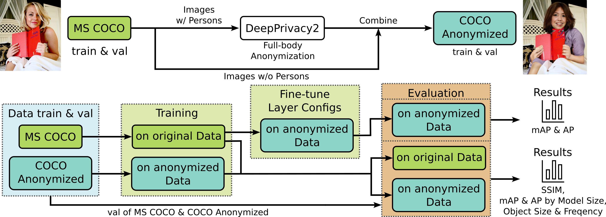

# Pipeline for Anonymization, Training and Evaluation of YOLO on Anonymized Data

| [📝 Paper ](https://link.springer.com/chapter/10.1007/978-3-032-02813-6_14) | [🗃️ Download Eval Dataset ](https://www.kaggle.com/datasets/sarahweisskaggle/aaal-eval-dataset) |

This repository provides a pipeline for anonymizing data & train/evaluate YOLO object detection models on anonymized data.
 

**Features**:
- Face and full-body anonymization via [DeepPrivacy2](https://github.com/hukkelas/deep_privacy2)
- [YOLO training](https://github.com/ultralytics/ultralytics) with flexible configuration
- Evaluation using [enhanced COCO metrics](https://github.com/yhsmiley/fdet-api) (AP, mAP, F1/F2, SSIM) and MATLAB scripts for graphs

**Workflow**


**Interested in a more detailed view of our experiments?**

See [our workflows for single experiments](doc/experiments.md).

**Interested in our training and finetuning?**

See [our training and fine-tuning doc](doc/training_and_finetune.md).

**Interested in our own Eval Dataset?**

Download it [here](https://www.kaggle.com/datasets/sarahweisskaggle/aaal-eval-dataset).


## Before you start
For easy overview of dependencies we added a single Dockerfile for every module.  
Modules did run fused together on our GPU-server. As training of larger YOLO needs a lot of VRAM, we recommend this for future users of this repo/code.

⚠ Dockerfiles contain hardware-related versions (e.g. CUDA) and paths - Please compare with used hardware before you start.

⚠ Configure volume mounts and all paths to suit your system and structure - see Dockerfiles and configuration files depending on what you want to do.

⚠ If you want to run other experiments with other settings, we highly advise you to carefully check all our configuration files as this pipeline is highly dependent on these. Also check the *Configuration* section of this README.

## Getting started

Build Docker images from within the repo folder with:
```bash
docker compose -f docker/build_all.yml build
```

## Annonymize your data

Run container and enter container:
```bash
docker compose -f privacy_docker-compose.yml up
```
```bash
docker compose exec -it deepprivacy2 bash
```

Configure data paths and wanted anonymization mode and run Anonymization with ```python3 anonymize.py```.


Full-Body Anonymization:
```bash
python3 anonymize.py configs/anonymizers/FB_cse.py -i /root/data/image.jpg --output_path /root/data/output_image.png
```

Face Anonymization:
```
python3 anonymize.py configs/anonymizers/face.py -i data/input.jpg --output_path data/output.png
```

## Training of YOLO models
Run container and enter container:
```bash
docker compose -f train_docker-compose.yml up
```
```bash
docker compose exec -it train_yolo bash
```

Depending on the goal of the training, we supply different bash scripts.
Training parameters for YOLO, paths to the data, and other arguments for the training script should be edited accordingly. Detailed information about configurations can be found below.

YOLOv10 over all model sizes:
```bash
./src/train_YOLOv10/train_all_model_sizes.sh
```

Finetune a YOLOv10 model with diffrent layer configurations:
```bash
./src/train_YOLOv10/train_all_model_sizes.sh
```

## Evaluation
Run container and enter container:
```bash
docker compose -f eval_docker-compose.yml up
```
```bash
docker compose exec -it eval bash
```

Evaluation utilizes the [COCO API](https://github.com/cocodataset/cocoapi) and enhances it with F1,F2 scores through [fdet-api](https://github.com/yhsmiley/fdet-api).
Depending on the desired metric and model we supply different scripts. For beautiful graphs run MATLAB files - results need to be parsed into .csv files.

AP, mAP, F1- & F2-scores
```bash
# all model sizes
./src/eval/eval_all_model_sizes.sh

# models with frozen layers
./src/eval/freeze_eval.sh

# or run script by direct call
python3 src/eval/run_eval.py -config "path to eval config" -net "folder name for model"
```
⚠ Pay attention to wanted folder structure! - Details in configuration section.

SSIM (m-size model)
```bash
./src/eval/eval_m_ssim.sh
```

Parse results to .csv:
```bash
./src/eval/helper/parse_results.py
```

## Configuration
The modules ```Training``` and ```Evaluation``` use thier own specific configuration file. These files can be found within the ```config``` folder.
This section gives a summary about thier general structure through some minimal examples.

### Training
*DATA_CONFIG_PATH*: To generate the file defining used classes see [Ultralytics documentation](https://docs.ultralytics.com/datasets/detect/coco/#dataset-yaml).

⚠ Configure our path to the used data (images and annotation) within the file given through this path.

Model parameter for the training of YOLO can be set in the bash script or in command line when calling ```train.py``` directly. Currently supported parametrs are (description at [parameter description of Ultralytics](https://docs.ultralytics.com/modes/train/#train-settings)):
- epochs
- batch size
- img size
- optimizer
- momentum
- weight decay
- freeze
- lr0
- lrf
- warmup epochs
- warmup momentum

Additional parameters are:
*model_path*: Path to the pretrained model or ```None``` for
*untrained_model*: Untrained model size configuration and path; default='yolov10n.yaml', will load required file automatically

⚠ If ```model_path``` is set the module will always try to load this model. Setting ```untrained_model``` wont do anything in this case - its only for our own documentation of you training config if a ```model_path``` is given.

```bash
# Define the path to your data configuration file
DATA_CONFIG_PATH="path_to_repo/config/train/fb_coco10.yaml"

# Optional parameters
EPOCHS=100
BATCH_SIZE=40
IMG_SIZE=640
OPTIMIZER="SGD"

# Array of model sizes
declare -a ModelSizes=("yolov10n.yaml" "yolov10s.yaml" "yolov10m.yaml" "yolov10l.yaml" "yolov10x.yaml")

# Loop through the model sizes and run the training script for each
for MODEL_SIZE in "${ModelSizes[@]}"
do
    echo "Starting training for model size: $MODEL_SIZE"
    python3 train.py "$DATA_CONFIG_PATH" --untrained_model=$MODEL_SIZE --epochs=$EPOCHS --batch_size=$BATCH_SIZE --img_size=$IMG_SIZE --optimizer=$OPTIMIZER --momentum=0.937 --weight_decay=0.0005
    echo "Training completed for $MODEL_SIZE"
done

echo "All models trained and saved successfully."
```

### Evaluation
We set on a specific file structure to load the model from, wich is derived from the way Ultralytics saves the trained weights:
```
model_path + "/" + script argument "-net" used as specific folder name + "/weights/last.pt"

Example path:
/path_to_repo/src/train_YOLOv10/runs/detect/fb_yolov10m/weights/last.pt
```

Set evaluation parameter in .yaml as descriped in this example:
```yaml
scene_name: 'fb_on_own_hd' # name of dataset, used as folder name to seve results
path_anno: '/path/to/dataset/annotations/fixed_id_instances.json' # path of coco annotations
path_imgs: '/path/to/own_dataset/images/' # path to imgs
model_path: '/this repo/src/train_YOLOv10/runs/detect' # path to model parameter file .pt
image_file_format: 'png' # file format of img, used to automatically grap all image paths
# array of wanted img ids (null means all ids)
img_ids: null # img to be evaluated on
cat_ids: null # wanted ids
# evaluation save paths
path_detections: '/this repo/data/detections' # path where to save detections
path_eval: '/this repo/data/eval' # main path where to save evaluation results, gets extendet by scene name
```

## Build and Run dependencies
- Docker & Docker compose
- [NVIDIA Container Toolkit](https://docs.nvidia.com/datacenter/cloud-native/container-toolkit/latest/install-guide.html)

⚠ Files contain Hardware related versions (e.g. Cuda) and Paths - Please compare with used Hardware before you start.

For every component see specific docker and docker compose file for further dependencies.

## External dependencies
- Evaluation results as graphs: MatLab (we worked with MatLab R2024b) - [Colormaps](https://www.mathworks.com/matlabcentral/fileexchange/120088-200-colormap), [Heatmaps](https://de.mathworks.com/matlabcentral/fileexchange/24253-customizable-heat-maps)

## Acknowledgements
This project uses code originally developed by:
- Hukkelås, Håkon and Lindseth, Frank -  [DeepPrivacy2](https://github.com/hukkelas/deep_privacy2)
- [yhsmiley](https://github.com/yhsmiley) - [fdet-api](https://github.com/yhsmiley/fdet-api)
- [Ultralytics](https://github.com/ultralytics/ultralytics)
- [COCO API](https://github.com/cocodataset/cocoapi)

## Authors
- 🦊 [Sarah Weiß](https://github.com/Fox93)
