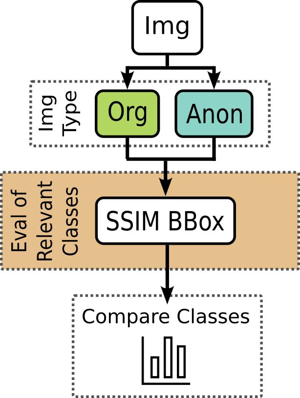
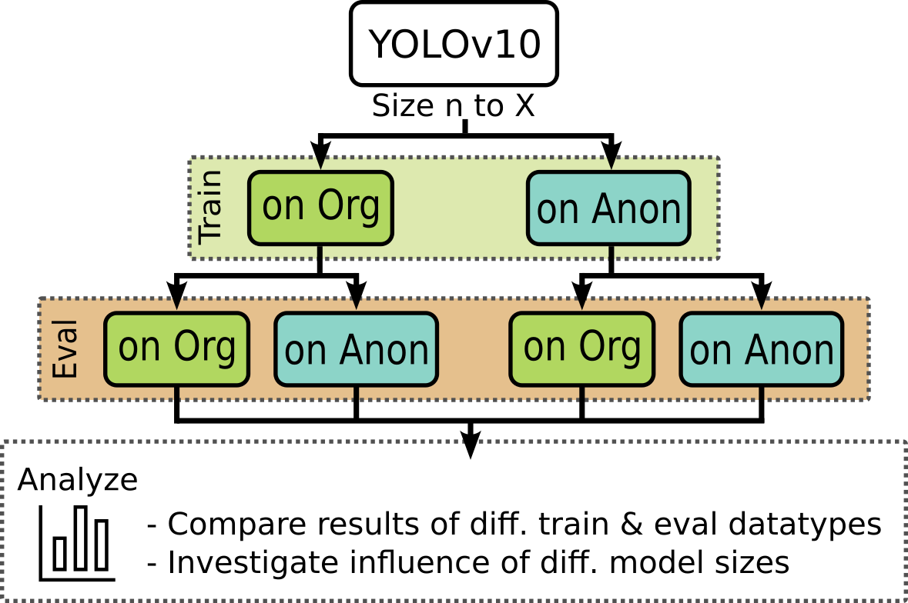
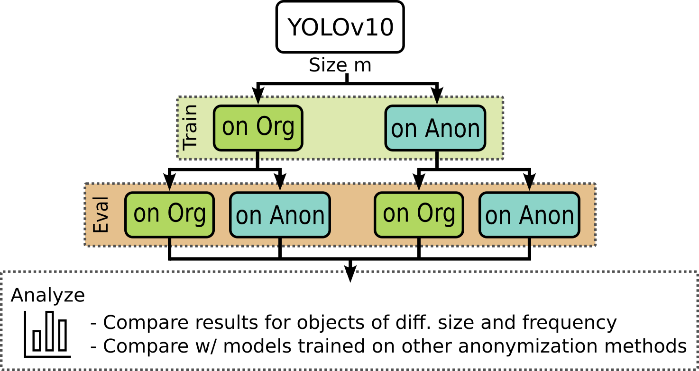
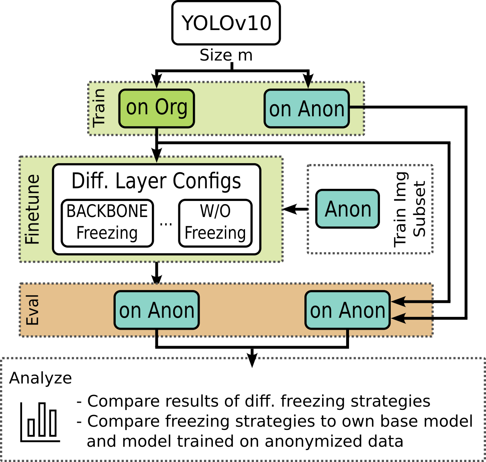
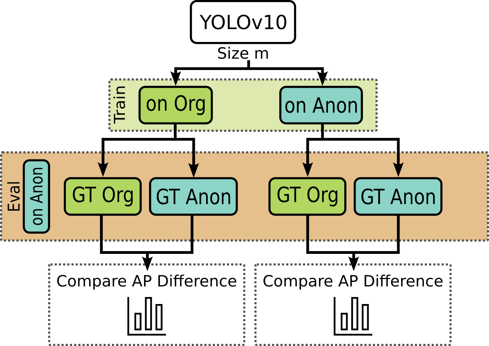

# Workflow of Experiments

Our proposed systematic training and evaluation methodology provides the opportunity to examine a wide range of aspects in detail.

The necessary models and results emerge from the overall approach and can be broken down into five subareas:

1. [Evaluation of Image Changes](#1-evaluation-of-image-changes)
2. [Influence of Model Size and Data Type on Training and Evaluation](#2-influence-of-model-size-and-data-type-on-training-and-evaluation)
3. [Influence of Object Size and Frequency within the Anonymized Class](#3-influence-of-object-size-and-frequency-within-the-anonymized-class)
4. [Evaluation of Different Fine-Tuning Strategies](#4-evaluation-of-different-fine-tuning-strategies)
5. [Influence of Label Error](#5-influence-of-label-error)

## 1. Evaluation of Image Changes
- Using SSIM
- Results are available for relevant bounding boxes and whole images of specific classes

## 2. Influence of Model Size and Data Type on Training and Evaluation
- All model sizes trained and evaluated on both data types
- Evaluation results include mAP or AP of specific classes

## 3. Influence of Object Size and Frequency within the Anonymized Class
- Using model size m
- Evaluation of defined objects, depending on their size and occurring frequency within the person class
- Also allows comparison with other work using specific model sizes

## 4. Evaluation of Different Fine-Tuning Strategies
- Using base model of size m trained on original data as the base for fine-tuning on anonymized data

## 5. Influence of Label Error
- Evaluation of differences between using labels from original data and labels modified to fit anonymized data

