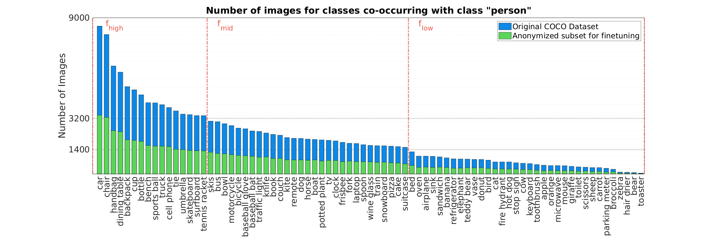

# Train parameter

The training methodology is realized according to [[Lee](https://ieeexplore.ieee.org/document/10387326/algorithms#algorithms)]. They train the models from scratch using default parameters except for the optimization method, which is changed from ```auto``` to ```SGD```. To retain comparability, we use a similar same configuration.

The only additional modification is an increased batch size of ```40```. To ensure reproducibility, the deterministic flag is set to ```True```, and the training seed is fixed at ```0```.

### Parameter Overview
| Parameter | Value |
| --- | --- |
| epochs| 100 |
| batch size | 40 |
| image size | 640 |
| optimizer | SGD |
| learn rate | 0.01 |
| momentum | 0.937 |
| weight decay | 0.0005 |
| warm-up | true |
| deterministic | True |
| seed | 0 |

# Fine-tuning parameter

To determine where anonymization affects the model's learning process, the ```Org``` model of size ```m```, is fine-tuned on anonymized data. To get an insight into which part of the model is influenced by the detection process, different configurations of frozen layers are trained.

By comparing the performance of different freezing strategies, it is possible to identify which step is mostly affected by anonymization and where its influence lies. Definitions of frozen layers can be seen below.

| Definitions | Layers |
| --- | --- |
| BACKBONE | 0 - 10 | 
| BACKBONE without PSA | 0 - 9 |
| NECK | 11 - 22 |
| NECK with HEAD | 11 - 23 |
| NECK with HEAD & PSA | 10 - 23 | 

To prevent overfitting on already-learned classes which are probably unaffected by anonymization, a specific subset of the anonymized training data is selected. Only images containing anonymized persons and the selected classes are used. A random sample comprising ```20``` of the full training set is drawn. To ensure class distributions are not over amplified, the image count per class in the fine-tuning subset is compared to the distribution in the full training set. The figure below shows this comparison, with the fine-tuning subset represented by green bars. Since the distributions align, the dataset is suitable for fine-tuning without introducing further biases.



### Parameter Overview
Settings for optimizer and batch size are adopted from the base model. Other values are based on suggestions from [[Bengio](http://arxiv.org/abs/1206.5533})] & [[Deep Learning by Goodfellow,Bengio and Courville](http://alvarestech.com/temp/deep/Deep%20Learning%20by%20Ian%20Goodfellow,%20Yoshua%20Bengio,%20Aaron%20Courville%20(z-lib.org).pdf) (p. 292-296)] and auto-tune feature of Ultralytics.  Parameters not listed here use default settings.

| Parameter | Value |
| --- | --- |
| epochs | 30 | 
| initial learning rate | 0.001 |
| final learning rate | 0.01 | 
| momentum | 0.85 |
| weight decay | 0.0007 |
| warmup epochs | 4 |
| warmup momentum | 0.8 | 
| optimizer | SGD |
| batch size | 40 |

